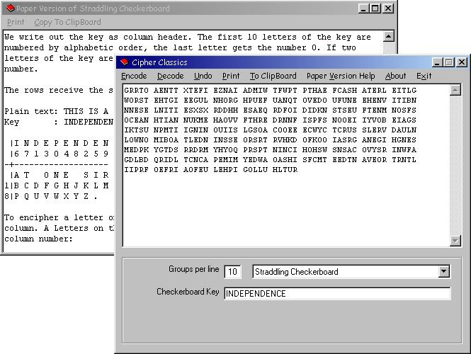



## \[ Cipher Classics \]

### Description

Encryption with a list of classic field-ciphers. Encrypt swift and easy with this program, or try out the pencil-and-paper versions by following the instructions on how to use them "in the field", as many secret agents and soldiers did. Use ADFGVX, Caesar Shift, Single or Double Columnar Transposition, Playfair, the Straddling Checkerboard or Vigenère. Discover now, after the thrill of using my Enigma machine ;-), the secret world of the field ciphers. All comments and ideas welcome ;-) *** New Updated 3/17 !!! added Print option ***
 
### More Info
 

             |
---                |---
**Submitted On**   |2005-03-16 20:17:20
**By**             |[D\. Rijmenants](https://github.com/Planet-Source-Code/PSCIndex/blob/master/ByAuthor/d-rijmenants.md)
**Level**          |Beginner
**User Rating**    |5.0 (30 globes from 6 users)
**Compatibility**  |VB 5\.0, VB 6\.0
**Category**       |[Encryption](https://github.com/Planet-Source-Code/PSCIndex/blob/master/ByCategory/encryption__1-48.md)
**World**          |[Visual Basic](https://github.com/Planet-Source-Code/PSCIndex/blob/master/ByWorld/visual-basic.md)
**Archive File**   |[\[\_Cipher\_C1865383172005\.zip](https://github.com/Planet-Source-Code/d-rijmenants-cipher-classics__1-58970/archive/master.zip)

